# AlphaTensor 2x2 Project Flow

Current scope: exact 2x2 matrix multiplication over GF(2).

```mermaid
flowchart TD
    A["1. Define 2x2 GF(2) scope - COMPLETED"] --> B["2. Build multiplication tensor - COMPLETED"]
    B --> C["3. Rank-one factors and exact verifier - COMPLETED"]
    C --> D["4. TensorGame transitions and rewards - COMPLETED"]
    D --> E["5. Enumerate 3,375 actions - COMPLETED"]
    E --> F["6. Generate synthetic demonstrations - COMPLETED"]
    F --> G["7. Build transformer policy-value network - COMPLETED"]
    G --> H["8. Train/validation pipeline and best checkpoint - COMPLETED"]
    H --> I["9. Run large transformer training - COMPLETED"]
    I --> J{"Validation metrics useful?"}
    J -- No --> K["Tune data, model and hyperparameters"]
    K --> I
    J -- Yes --> L["10. Implement policy-guided beam search - COMPLETED"]
    L --> M["Search from real multiplication tensor - ATTEMPTED"]
    M --> N{"Zero residual within 7 moves?"}
    N -- No --> O["11. Add target replay/self-play improvement - COMPLETED"]
    O --> U{"Rank-7 found after replay?"}
    U -- No --> V["12. Add symmetry augmentation and multi-action targets - COMPLETED"]
    V --> W["13. Exact local repair around learned rank-8 solution - COMPLETED"]
    W --> X["14. Policy-guided Monte Carlo tree search - COMPLETED"]
    X --> Y["15. MCTS trajectory replay and fine-tuning loop - COMPLETED"]
    Y --> Z["16. Visit-count policy targets and batched MCTS - COMPLETED"]
    Z --> AA["17. Quality filtering, rollback and best-checkpoint retention - COMPLETED"]
    AA --> AB["18. Exact 5-to-4 repair across all rank-8 neighborhoods - COMPLETED"]
    AB --> AC["19. Global exact rank-7 constraint solver and policy comparison - COMPLETED"]
    AC --> P["Exact rank-7 verification - COMPLETED"]
    U -- Yes --> P
    N -- Yes --> P
    P --> Q["Test all 256 GF(2) input pairs - COMPLETED"]
    Q --> R["20. Repeat solver and policy evaluation across random seeds - COMPLETED"]
    R --> AD["21. Convert rank-7 solution into subset expert targets - COMPLETED"]
    AD --> AE["Expert fine-tuning with symmetry augmentation - COMPLETED"]
    AE --> AF{"Policy search reaches zero residual in 7 moves?"}
    AF -- Yes --> AG["Solver-disabled rank-7 verification - COMPLETED"]
    AG --> AH["22. Robustness and generalization evaluation - COMPLETED"]
    AH --> S["Export equations, CLI and documentation - COMPLETED"]
    S --> T["2x2 GF(2) PROTOTYPE COMPLETE"]
```

## Completion checklist

- [x] Mathematical tensor representation
- [x] Exact decomposition verification
- [x] TensorGame environment
- [x] Discrete action catalog
- [x] Synthetic demonstration generator
- [x] Transformer policy-value model (MLP retained as baseline)
- [x] Training/validation loop, metrics, early stopping and best checkpoint
- [x] Large-scale transformer supervised training
- [x] Policy-guided beam search with exact two-step tail completion
- [x] Target-specific trajectory replay and transformer fine-tuning
- [x] Rank-preserving GF(2) symmetry augmentation
- [x] Multi-action replay targets (up to eight valid actions per state)
- [x] Exact 2-to-1, 3-to-2 and 4-to-3 local repair search
- [x] Policy-guided PUCT Monte Carlo tree search
- [x] MCTS trajectory replay, symmetry augmentation and cyclic fine-tuning
- [x] Sparse MCTS visit-count policy distributions and batched multi-tree search
- [x] Outcome-weighted filtering, regression rollback and best-checkpoint retention
- [x] Exhaustive 5-to-4 meet-in-the-middle repair across three rank-8 solutions
- [x] Independent global discovery of an exact rank-7 decomposition
- [x] Exhaustive correctness testing on all input pairs
- [x] Repeatability evaluation
- [x] Solver-bootstrapped subset-state expert curriculum
- [x] Solver-disabled policy beam-search rank-7 result
- [x] Beam-width threshold and noisy-seed robustness evaluation
- [x] Algorithm export, CLI and final documentation

The 2x2 GF(2) prototype independently discovered and exactly verified multiple
seven-multiplication decompositions. After expert bootstrapping, the transformer
policy also generated a verified rank-7 path without a solver during evaluation.

## Latest transformer training result

- Training games: 10,000 (60,021 labeled residual states)
- Validation games: 1,000 (6,011 labeled residual states)
- Architecture: compact tensor transformer with global residual projection
- Best epoch: 11 (early stopping at epoch 16)
- Best validation loss at selected checkpoint: 6.5481
- Best-checkpoint validation top-1 accuracy: 19.797%
- Best-checkpoint validation top-5 accuracy: 27.683%
- Parameters: 330,096
- Checkpoint: `checkpoints/transformer_policy_value.pt`
- Beam-search implementation: complete
- Initial target replay cycles: 3 (464 retained records)
- Symmetry-augmented cycles: 3 (22,180 retained records)
- Post-symmetry validation top-1/top-5: 22.342% / 29.762%
- Best post-replay search result: one nonzero tensor entry remains after 7 actions
- This gives an exact 8-multiplication decomposition after appending the rank-1 residual
- Independent rank-7 discovery attempt: not yet successful
- Local repair: all 154 subsets through 4-to-3 checked; no rank-7 repair exists
- MCTS experiments: 5,000 standard and 10,000 high-exploration simulations
- MCTS found a second exact rank-8 neighborhood, but no rank-7 decomposition
- MCTS replay cycles: 2 (27,621 retained records)
- Post-MCTS-replay validation top-1/top-5: 22.426% / 29.829%
- Final 10,000-simulation search: one rank-one residual; no rank-7 result
- Visit-distribution replay: 4,262 states; batched four-tree inference operational
- Distribution checkpoint top-5: 29.679%; retained best remains 29.829% MCTS checkpoint
- Distribution training found a third exact rank-8 neighborhood; no local rank-7 repair
- Quality-filtered cycles: both rejected; incumbent 29.829% checkpoint preserved exactly
- Quality policy replay: 4,303 rank-one-terminal filtered states
- Exact local coverage: all 630 subsets removing 2 through 5 actions across three solutions
- No rank-7 decomposition shares three or more terms with the learned rank-8 neighborhoods
- Global SAT solution: `[24, 332, 1117, 1646, 2479, 2888, 3315]`
- Solver time: 117.692 seconds; exact tensor verification passed
- Exhaustive binary matrix tests: all 256 input pairs passed
- RL policy did not independently reach the complete path; sequential ranks ranged from 1 to 575
- Repeatability: 3/3 solver seeds found exact rank 7; three distinct solutions
- Solver times across seeds: 75.020, 89.858 and 79.704 seconds
- MCTS repeatability: 0/3 rank-7 successes; residual rank 1 in every run
- Expert curriculum: 127 nonterminal subset states from one coherent solution
- Symmetry-augmented expert replay: 635 unique states
- Expert fine-tuning success: epoch 6; expert top-5 97.480%
- Solver-disabled beam rank-7 path: `[24, 2479, 1117, 2888, 1646, 3315, 332]`
- Exact-tail completion disabled; residual is exactly zero after action 7
- Learned result passed exact tensor reconstruction and all 256 input pairs
- Robustness: deterministic success begins at beam width 256
- Policy-noise robustness: 5/5 successes at noise 0.02
- All six successful runs reproduced the taught factor set; no novel solution
- Automated tests: 62 passing
- Status: 2x2 GF(2) research prototype complete
